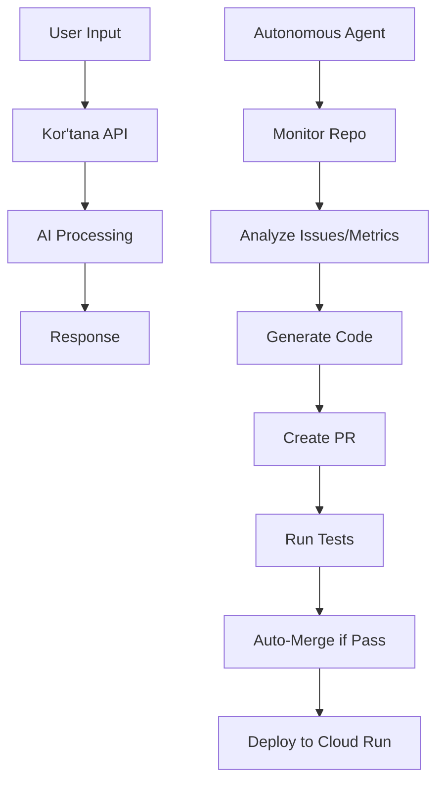

# Autonomous Development Workflow and Branching Strategy for Kor'tana

## 1. Introduction

Kor'tana is a multimodal AI application designed to evolve autonomously, integrating with Google AI Studio, Cloud Run, VS Code, and GitHub. This document outlines a comprehensive design for an autonomous development workflow that enables the system to self-improve without human intervention, including branching strategies, CI/CD pipelines, task automation, self-testing, security measures, and growth loops.

## 2. Project Overview

- **Technology Stack**: Python with FastAPI for the API layer, TensorFlow/PyTorch for AI model handling.
- **Core Functionality**: Multimodal AI processing (text, image, audio) with autonomous evolution capabilities.
- **Integrations**:
  - Google AI Studio: Model training and deployment.
  - Cloud Run: Serverless hosting.
  - VS Code: Development environment and extensions.
  - GitHub: Repository management, CI/CD via Actions.
- **Autonomy Goal**: Full self-driving development cycle, including code generation, testing, deployment, and monitoring.

## 3. System Architecture

The architecture is modular, with components for the core app, autonomous agent, and integrations.

### Core Components
- **Kor'tana API**: FastAPI-based service handling multimodal inputs and outputs.
- **AI Models**: TensorFlow/PyTorch models for processing.
- **Autonomous Agent**: AI-driven component using LLMs (e.g., GPT-4) to analyze, generate, and deploy code.
- **Database**: For storing user data, metrics, and feedback.
- **Monitoring Layer**: Logs, metrics, and alerts via GCP.

### Integration Layer
- **Google AI Studio**: For advanced AI tasks.
- **Cloud Run**: Deployment target.
- **VS Code**: Provides IDE extensions for development.
- **GitHub**: Source control and automation.

### Workflow Architecture


## 4. Branching Strategy

Adopt Git Flow with autonomous extensions.

- **main**: Production-ready code.
- **develop**: Integration branch.
- **feature/***: Human-initiated features.
- **autonomous/***: Agent-generated changes (e.g., autonomous/feature-improvement).
- **hotfix/***: Urgent fixes.
- **release/***: Release candidates.

Agent creates branches prefixed with `autonomous/`, pushes changes, creates PRs targeting `develop` or `main` based on risk assessment.

## 5. CI/CD Pipelines

GitHub Actions for automation.

- **On Push to main/develop**: Build, test, deploy.
- **On PR**: Run tests, security scans.
- **Scheduled**: Autonomous tasks (daily).

Deployment: Build Docker image, push to GCR, deploy to Cloud Run.

## 6. Autonomous Task Handling

The Autonomous Agent uses GitHub API and AI to:
- Monitor issues, PRs, commits.
- Analyze logs/metrics for bottlenecks.
- Generate code improvements (refactoring, new features).
- Create branches and PRs.
- Monitor test results and merge if successful.

Triggers: Scheduled runs, webhook events (e.g., failed builds).

## 7. Self-Testing and Validation Systems

- **Unit Tests**: Pytest for core functions.
- **Integration Tests**: Test API endpoints.
- **AI-Generated Tests**: Agent creates tests for new code.
- **Performance Tests**: Load testing with Locust.
- **Validation**: Code linting, type checking (mypy).

Agent reviews test coverage and generates missing tests.

## 8. Security Measures

- **Code Scanning**: GitHub CodeQL.
- **Dependency Checks**: Safety, Dependabot.
- **Secrets Management**: GitHub Secrets, GCP Secret Manager.
- **Access Control**: Branch protection rules, required reviews (except for autonomous PRs with high confidence).
- **Compliance**: GDPR, data encryption.

Agent scans for vulnerabilities and generates fixes.

## 9. Growth Loops

- **Feedback Collection**: User interactions, error logs.
- **Metric Analysis**: Performance, usage patterns.
- **Evolution Triggers**: Low performance → generate optimizations; New patterns → new features.
- **Model Retraining**: Use feedback to fine-tune AI models.

Agent proposes growth tasks based on data analysis.

## 10. Monitoring and Alerting Systems

- **Tools**: GCP Cloud Monitoring, Logging.
- **Metrics**: Response time, error rate, resource usage.
- **Alerts**: Slack/webhook notifications for failures.
- **Dashboards**: Real-time views of system health.

Agent monitors and self-heals (e.g., restart services).

## 11. GitHub Actions Workflows

### CI Workflow (.github/workflows/ci.yml)
```yaml
name: CI
on:
  push:
    branches: [main, develop]
  pull_request:
jobs:
  test:
    runs-on: ubuntu-latest
    steps:
    - uses: actions/checkout@v2
    - name: Set up Python
      uses: actions/setup-python@v2
      with:
        python-version: 3.9
    - name: Install dependencies
      run: pip install -r requirements.txt
    - name: Run tests
      run: pytest
    - name: Lint
      run: flake8 .
```

### Autonomous Workflow (.github/workflows/autonomous.yml)
```yaml
name: Autonomous Development
on:
  schedule:
    - cron: '0 0 * * *'  # Daily
jobs:
  analyze:
    runs-on: ubuntu-latest
    steps:
    - uses: actions/checkout@v2
    - name: Analyze codebase
      run: python scripts/analyze.py  # AI analysis script
    - name: Generate improvements
      run: python scripts/generate_code.py
    - name: Create PR
      run: python scripts/create_pr.py
```

### Deployment Workflow (.github/workflows/deploy.yml)
```yaml
name: Deploy
on:
  push:
    branches: [main]
jobs:
  deploy:
    runs-on: ubuntu-latest
    steps:
    - uses: actions/checkout@v2
    - name: Build Docker
      run: docker build -t gcr.io/project/kortana .
    - name: Push to GCR
      run: docker push gcr.io/project/kortana
    - name: Deploy to Cloud Run
      run: gcloud run deploy kortana --image gcr.io/project/kortana --platform managed
```

This design enables Kor'tana to operate autonomously, continuously improving itself through AI-driven processes.